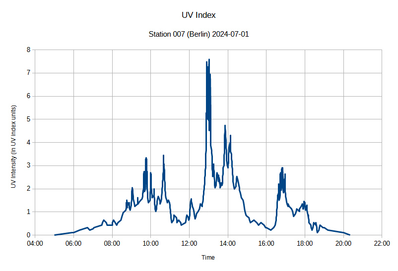

# Example 1

## Requesting data from iot.sglux.com 
(or any other instance of [Thingsboard](https://thingsboard.io/) if you like)

### Requirements

* **_In any case it is required_** to create a copy of [tb_credentials.py](tb_credentials.py) to a file `my_tb_credentials.py` and fill in valid login credentials of a thingsboard tenant admin user, e.g. a user that is entitled to access the [Thingsboard API](https://thingsboard.io/docs/api/).
* **_In any case it is required_** to create a copy of [tb_server_defs.py](tb_server_defs.py) to `my_tb_server_defs.py` and enter the correct IP-address or full domain name of your thingsboard instance. It does not matter if thingsboard comes as PaaS or is self deployed, dockerized, Personal or Community Edition. In case you have an account on sglux's thingsboard instance, the server URL is `https://iot.sglux.com`.
* The required python packages are listed in the `requirements.txt` file and could be installed via pip: `python -m pip install -r requirements.txt`.

### What it does

1) it presents a list of all known device types, in our case we are interested in devices of type sg-iot-gen.
2) it presents a list of all devices of the selected type to choose from
3) it presents a list of all avalable timeseries of that particular device to choose from
4) it exports the requested data into an CSV file on your desktop

### Demo output

```
List of available device types in your account
+-------+----------------+
| Index |   deviceType   |
+-------+----------------+
|   0   |  sg-iot-gen3   |
|   1   |  sg-iot-gen4   |
+-------+----------------+
Which device type [0...1 | def:0] : 0

List of the devices of the specified type
+-------+------------+--------------------------------------+
| Index | deviceName |               deviceID               |
+-------+------------+--------------------------------------+
|   0   |  uvi-007   | bf1dab50-3c59-11ea-9971-7bb46b5016ac |
|   1   |  uvi-014   | eab4b170-c5be-11ea-9a44-758343c7782f |
|   2   |  uvi-016   | 4622de90-a4ce-11ea-a8c2-b7228279ba0d |
|   3   |  uvi-017   | eff9c800-c519-11ea-9a44-758343c7782f |
|   4   |  uvi-018   | 95520760-c77a-11ea-9a44-758343c7782f |
+-------+------------+--------------------------------------+
Enter the device by index [0...4 | def:0] : 0

List of the attributes of the selected device
+-------+---------------------+-----------------+
| Index |      Attribute      |      Value      |
+-------+---------------------+-----------------+
|   0   |         aat         |       600       |
|   1   |         fmi         |       1800      |
|   2   |          ip         |   100.68.64.4   |
|   3   |      lastupdate     |  1600657440000  |
|   4   |         name        |     uvi_007     |
|   5   |          op         |       BEC       |
|   6   |        sensor       |       4543      |
|   7   |        serial       | 133-018-027-000 |
|   8   |         lat         |        1        |
|   9   |         lon         |        1        |
|   10  |        active       |      False      |
|   11  | inactivityAlarmTime |  1600706711134  |
|   12  |   lastActivityTime  |  1600706691997  |
|   13  |   lastConnectTime   |  1600701487958  |
|   14  |  lastDisconnectTime |  1600701473633  |
+-------+---------------------+-----------------+

List of the available time series of the selected device
+-------+----------------+
| Index | timeseries Key |
+-------+----------------+
|   0   |      auxv      |
|   1   |      batc      |
|   2   |      batv      |
|   3   |     gsmrx      |
|   4   |     gsmtx      |
|   5   |      ont       |
|   6   |      rssi      |
|   7   |      supv      |
|   8   |      temp      |
|   9   |      tof       |
|   10  |      upt       |
|   11  |      uvi       |
|   12  |      uviv      |
+-------+----------------+
Select the telemetry type by index [0...12 | default: 11] : 11
Ok, pulling telemetry of type uvi

Enter start time (YYYY-MM-DD HH:MM): 2020-09-09 00:00 
Enter start time (YYYY-MM-DD HH:MM): 2020-09-10 22:00

Requesting Data for time range 1599602400 to 1599688800
Received Data Points: 844

Written 844 Data Points of device uvi-007 from 2020-09-09 00:00:00 to 2020-09-10 00:00:00 into file C:\Users\stefan\Desktop\uvi-007_data.csv
```
### Result
A CSV file is created in the given path containing the requested data. 

If you requested UVI values from a given period the file content looks like this:
```
Timestamp;Time;uvi-007/uvi
1719784801;2024-07-01 00:00:01;0
1719788401;2024-07-01 01:00:01;0.053814
1719792001;2024-07-01 02:00:01;0
1719795601;2024-07-01 03:00:01;0.053814
1719799201;2024-07-01 04:00:01;0.053814
1719802801;2024-07-01 05:00:01;0
1719806112;2024-07-01 05:55:12;0.107628
1719806401;2024-07-01 06:00:01;0.107628
1719807532;2024-07-01 06:18:52;0.215256
1719808972;2024-07-01 06:42:52;0.322884
1719809422;2024-07-01 06:50:22;0.215256
1719810001;2024-07-01 07:00:01;0.269070
1719810212;2024-07-01 07:03:32;0.322884
1719811662;2024-07-01 07:27:42;0.430512
1719811792;2024-07-01 07:29:52;0.538140
1719812022;2024-07-01 07:33:42;0.645768
1719812492;2024-07-01 07:41:32;0.538140
1719812662;2024-07-01 07:44:22;0.430512
1719813601;2024-07-01 08:00:01;0.430512
1719813682;2024-07-01 08:01:22;0.538140
1719813852;2024-07-01 08:04:12;0.645768
1719814162;2024-07-01 08:09:22;0.538140
1719814442;2024-07-01 08:14:02;0.430512
1719814672;2024-07-01 08:17:52;0.538140
1719815232;2024-07-01 08:27:12;0.645768
...
```
These data then can be easily imported in Libreoffice or Excel to be plotted and evaluated, this graph is a simple example of the UV intensity.

